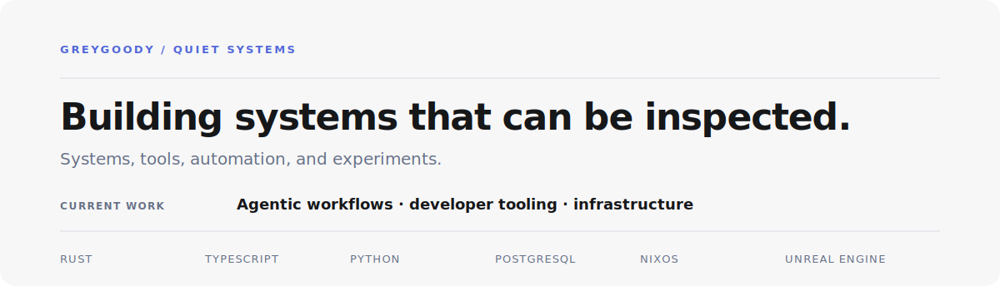

<picture>
  <source media="(prefers-color-scheme: dark)" srcset="./assets/profile-dark.svg">
  <source media="(prefers-color-scheme: light)" srcset="./assets/profile-light.svg">
  
</picture>

 

01 / PROFILE

I am a game, application, and systems developer working with **Rust**, **TypeScript**, **Python**, and **Unreal Engine**. I focus on explicit state, testable boundaries, observable execution, and software another developer can operate without continuous interpretation.

**Current objective:** Seeking a full-stack engineering role in automation and AI platforms.

---

02 / CURRENT SYSTEMS

| State | System | Current boundary |
| --- | --- | --- |
| `active` | **Shelf** | Versioned item identity and inventory state with deterministic, testable transitions. |
| `prototype` | **Orb** | A typed communication layer for agents and distributed automation. |
| `closure` | **Codectx** | Branch-scoped task state, proof commands, and a read-only engineering context. |

Status labels describe current maturity. They are not substitutes for evidence.

---

03 / ENGINEERING SURFACE

`Rust` · `TypeScript` · `Python` · `Unreal Engine` · `Linux` · `Docker` · `Git`

Event-driven systems · agentic workflows · developer tooling · self-hosted infrastructure

---

04 / OPERATING RULE

Keep the boundary small. Encode the contract. Test state changes. Record evidence. Delete what does not improve the outcome.
